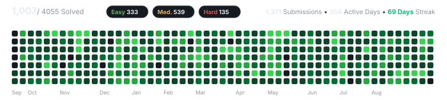

# Hi there, I'm Tousif Tamboli

**Software Engineer** • Savitribai Phule Pune University (B.Tech CS & Data Science, CGPA 8.9/10)  
Passionate about building autonomous agentic workflows, production RAG pipelines, and high-throughput backend infrastructure.

  
  &nbsp;
  
  &nbsp;
  
  &nbsp;
  
  &nbsp;
  
  &nbsp;
  

---

### What I Do

- **Autonomous & Agentic AI:** Architecting multi-agent orchestrations, LangGraph state machines, schema-validated tool-calling pipelines, and Model Context Protocol (MCP) integrations.
- **Production RAG & Search:** Engineering dense + sparse (BM25) hybrid retrieval pipelines with cross-encoder re-ranking, smart chunking, and low-latency vector search.
- **High-Performance Backends:** Building event-driven microservices, webhook ingestion systems, Redis caching layers, and optimized relational / document database schemas.
- **Full-Stack Delivery:** Crafting responsive web apps with Next.js/React, robust RBAC authentication, Docker containerization, and automated CI/CD pipelines.

---

### Technical Skills

<table>
  <tr>
    <td width="20%"><b>Languages & APIs</b></td>
    <td>
      
      
      
      
      
    </td>
  </tr>
  <tr>
    <td><b>Agentic AI & LLMs</b></td>
    <td>
      
      
      
      
      
      
      
    </td>
  </tr>
  <tr>
    <td><b>Backend & Full-Stack</b></td>
    <td>
      
      
      
      
      
      
    </td>
  </tr>
  <tr>
    <td><b>Databases & Cache</b></td>
    <td>
      
      
      
      
    </td>
  </tr>
  <tr>
    <td><b>DevOps & Cloud</b></td>
    <td>
      
      
      
      
      
    </td>
  </tr>
</table>

---

### Experience & Milestones

- **Software Developer Intern — Tortus AI** *(Dec 2025 – June 2026)*
  - Engineered scalable backend microservices for a production GenAI platform serving **50,000+ active users** with **99.9% uptime**.
  - Shipped event-driven API endpoints and webhooks powering real-time AI workflow execution and structured response rendering.
  - Integrated multi-agent LLM tool-calling with strict schema validation, **reducing parsing errors by 35%**.

- **1st Place Winner — E-CELL IIT Bombay Hackathon**
  - Designed and built an autonomous agentic automated support workflow under competitive time constraints.

- **Freelance Software Engineer** *(2023 – 2025)*
  - Delivered **7+ end-to-end client applications**, overseeing architecture design, API development, frontend implementation, and cloud deployment.

- **B.Tech in Computer Science (Data Science)** — Savitribai Phule Pune University *(2022 – 2026)*
  - Academic Standing: **CGPA 8.9 / 10.0**

---

### GitHub Activity

---

### LeetCode Progress

---

### Let's Connect

I'm always keen to discuss **agentic AI architectures**, **distributed systems**, or collaborate on impactful open-source projects.

  <a href="https://tousif.online"><b>Website</b></a> •
  <a href="https://linkedin.com/in/tousiftamboli"><b>LinkedIn</b></a> •
  <a href="https://leetcode.com/u/TMT3/"><b>LeetCode</b></a> •
  <a href="https://x.com/thisistousif"><b>Twitter / X</b></a> •
  <a href="mailto:tousiftamboli3@gmail.com"><b>Email</b></a>

